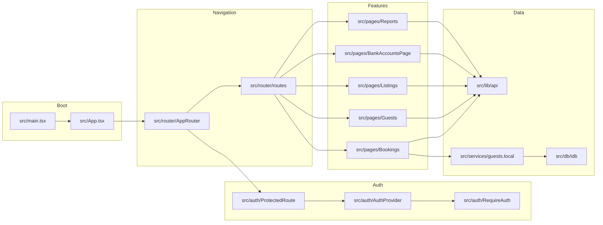
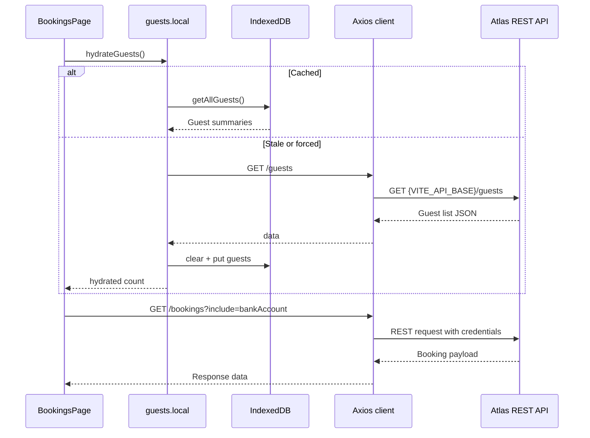

# Architecture

## System Overview

The admin portal is a single-page React application bootstrapped by Vite. The entry point composes React Router, React Query, an application-wide error boundary, and the Auth0 provider (with optional bypass). 【F:src/main.tsx†L4-L30】【F:src/auth/AuthProvider.tsx†L5-L35】【F:src/components/ErrorBoundary.tsx†L1-L36】 REST requests funnel through a shared Axios client that enforces the configured API base URL and warns when non-JSON responses are returned. 【F:src/lib/api.ts†L1-L32】【F:src/utils/env.ts†L1-L8】 Guest data is hydrated into IndexedDB to accelerate typeahead search and offline scenarios. 【F:src/services/guests.local.ts†L1-L25】【F:src/db/idb.ts†L1-L26】

## Context Diagram

```mermaid
graph TD
  AdminUser[Operations team user]
  Auth0[(Auth0 tenant)]
  AtlasAPI[(Atlas REST API)]
  IndexedDB[(Browser IndexedDB cache)]
  ViteDev[Vite dev server]

  AdminUser -->|Login + navigation| Portal
  Portal[Atlas Admin Portal (React/Vite)] -->|Auth0Provider| Auth0
  Portal -->|Axios REST calls| AtlasAPI
  Portal -->|Guest hydration| IndexedDB
  AdminUser -->|Localhost:5173| ViteDev
  ViteDev -->|Proxies /api -> backend| AtlasAPI
```

## Module Graph



## Request Flow



## Deployment Notes

- Vite dev server proxies `/api` to the configured backend (defaulting to `http://localhost:5287`) and production builds error if `VITE_API_BASE` is not HTTPS. 【F:vite.config.ts†L5-L33】
- `scripts/no-localhost.js` fails the build when `http://localhost` is hard-coded outside of tests to avoid leaking dev URLs. 【F:scripts/no-localhost.js†L1-L24】
- Production bundles should inject Auth0 secrets via Vite env variables (e.g., Cloudflare Pages build variables). 【F:src/App.tsx†L7-L15】【F:src/auth/AuthProvider.tsx†L5-L35】
