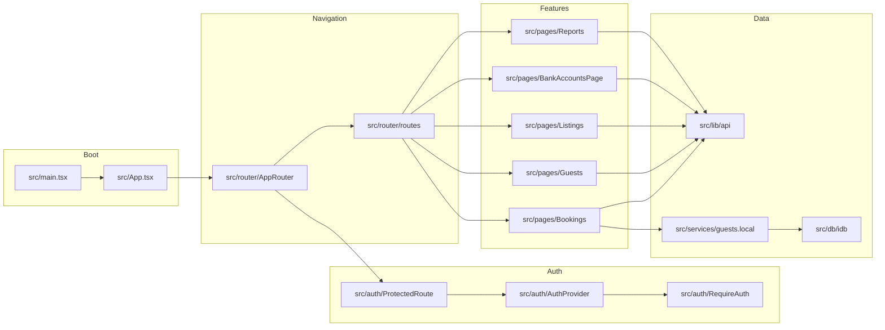
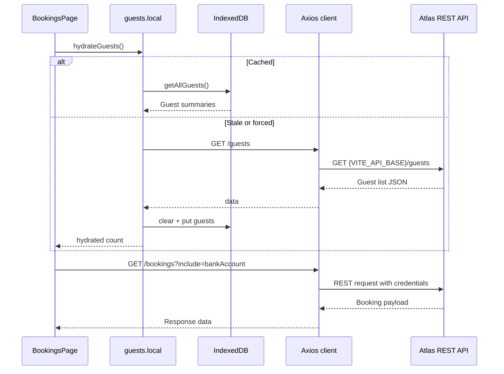

# Atlas Admin Portal — Discovery Report

## Stack Profile

- **Framework:** React 18 SPA bootstrapped with Vite 4 and React Router 6. 【F:package.json†L1-L32】【F:src/main.tsx†L4-L30】【F:src/router/AppRouter.tsx†L1-L33】
- **State & data:** React Query for caching, Axios for REST calls, IndexedDB (via `idb`) for guest search hydration. 【F:src/main.tsx†L4-L30】【F:src/lib/api.ts†L1-L32】【F:src/services/guests.local.ts†L1-L25】【F:src/db/idb.ts†L1-L26】
- **UI:** MUI 7 (core, lab, x-date-pickers), Recharts, jsPDF, PapaParse. 【F:package.json†L13-L32】【F:src/components/EarningsReport.jsx†L1-L80】
- **Auth:** Auth0 React SDK with local bypass and email allow list enforcement. 【F:src/auth/AuthProvider.tsx†L5-L35】【F:src/auth/RequireAuth.tsx†L1-L15】
- **Build tooling:** ESLint, Prettier (docs), Vitest, Vite build-time guard ensuring HTTPS API base. 【F:package.json†L6-L32】【F:.eslintrc.cjs†L1-L27】【F:vite.config.ts†L5-L33】

## Commands

```bash
npm install          # install dependencies
npm run dev          # start Vite dev server on http://localhost:5173
npm test -- --run    # run Vitest suite
npm run lint         # ESLint (React/TS rules)
npm run format       # Prettier check for docs/config
npm run build        # production build with HTTPS API guard
npm audit            # dependency vulnerability report
```

【F:package.json†L6-L32】【F:vite.config.ts†L5-L33】【0fae28†L1-L16】

## High-Level Architecture

```mermaid
graph TD
  AdminUser[Operations team user]
  Auth0[(Auth0 tenant)]
  AtlasAPI[(Atlas REST API)]
  IndexedDB[(Browser IndexedDB cache)]
  ViteDev[Vite dev server]

  AdminUser -->|Login + navigation| Portal
  Portal[Atlas Admin Portal (React/Vite)] -->|Auth0Provider| Auth0
  Portal -->|Axios REST calls| AtlasAPI
  Portal -->|Guest hydration| IndexedDB
  AdminUser -->|Localhost:5173| ViteDev
  ViteDev -->|Proxies /api -> backend| AtlasAPI
```





## API, Events, Data

- **REST endpoints:** See [`docs/api/rest-endpoints.md`](docs/api/rest-endpoints.md) for full CRUD inventory across bookings, guests, listings, properties, bank accounts, and reporting endpoints. 【F:docs/api/rest-endpoints.md†L1-L40】
- **Events/queues:** None observed.
- **Local storage:** IndexedDB database `atlas-admin` with `guests` object store (`id` key, `_n` search index). 【F:src/db/idb.ts†L1-L26】
- **Config:** Vite env vars for API base, Auth0 settings, bypass flags, allowed emails. `.env.example` documents required keys. 【F:src/config/env.ts†L1-L35】【F:.env.example†L1-L12】

## Build & Deployment Notes

- Dev server proxies `/api` to `VITE_API_BASE` (default `http://localhost:5287`) and merges credentials for cross-origin cookies. 【F:vite.config.ts†L21-L33】【F:src/lib/api.ts†L1-L32】
- Production builds log/throw if `VITE_API_BASE` is misconfigured (missing or pointing to localhost). 【F:src/App.tsx†L7-L15】【F:src/utils/env.ts†L1-L8】
- `scripts/no-localhost.js` enforces no hard-coded `http://localhost` references. 【F:scripts/no-localhost.js†L1-L24】

## Quality Gates

- **Tests:** Vitest suite covers hooks, routing, env utils, guest typeahead, and reports. 【F:package.json†L6-L12】【8290fa†L1-L20】
- **Lint:** ESLint with React + TypeScript plugin (warnings for unused imports). 【F:.eslintrc.cjs†L1-L27】【9f68f5†L1-L34】
- **Format:** Prettier check for Markdown/JSON/YAML via `npm run format`. 【F:package.json†L6-L12】
- **Dependencies:** `npm audit` currently reports 4 vulnerabilities (2 moderate, 2 high); prioritize remediation or mitigation. 【0fae28†L7-L15】

## Risks & Hotspots

- **Auth allow list is client-enforced:** Ensure backend also enforces roles to avoid bypassing via network tooling. 【F:src/auth/RequireAuth.tsx†L1-L15】
- **Large legacy JSX files:** Several pages (Bookings, Reports) contain extensive inline logic and commented code, increasing lint noise and maintenance effort. 【F:src/pages/Bookings.jsx†L1-L440】【F:src/pages/Reports.jsx†L1-L37】
- **Guest cache staleness:** IndexedDB cache relies on `localStorage` timestamp; manual refresh may be needed if background jobs mutate guest data. 【F:src/services/guests.local.ts†L6-L25】
- **Audit findings:** Dependencies include outdated packages with known advisories; schedule upgrades (React Router warnings appear in test output). 【F:package.json†L13-L32】【c1e2af†L1-L20】

## Suggested Roadmap

- **Day 1:** Ship the first-pr cleanup (remove unused report imports), run lint/tests, document findings. 【F:docs/first-pr.md†L1-L27】
- **Week 1:** Modularize large pages (Bookings, Reports) into smaller components and resolve ESLint warnings for unused variables/imports. 【F:src/pages/Bookings.jsx†L1-L440】【9f68f5†L1-L34】
- **Month 1:** Introduce automated API contract testing (e.g., mock server or schema validation), address dependency vulnerabilities, and evaluate server-side enforcement of Auth0 allow list. 【F:package.json†L13-L32】【0fae28†L7-L15】【F:src/auth/RequireAuth.tsx†L1-L15】
